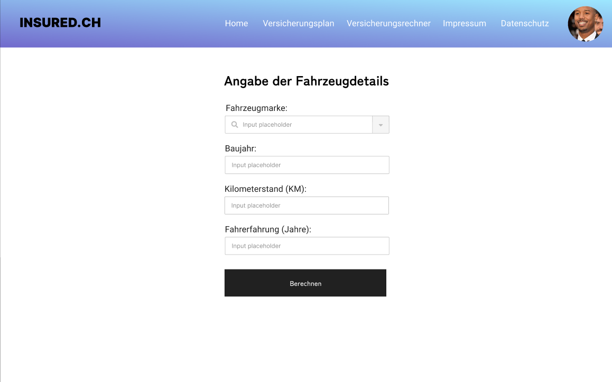
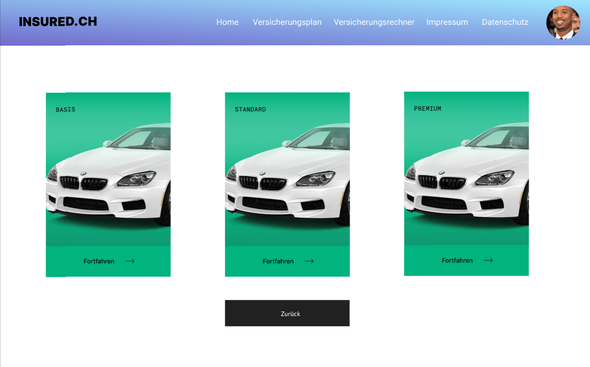
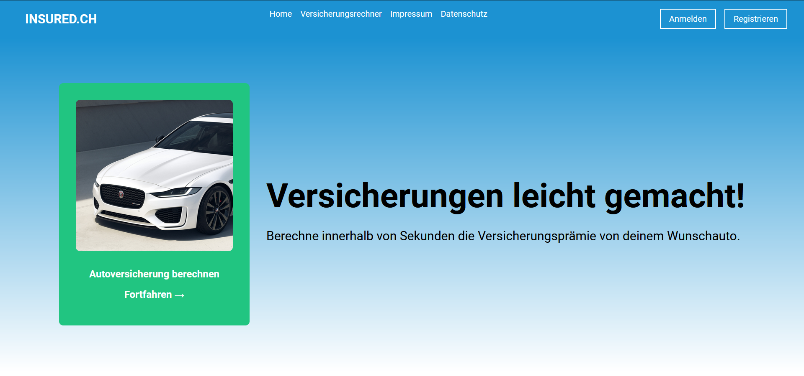
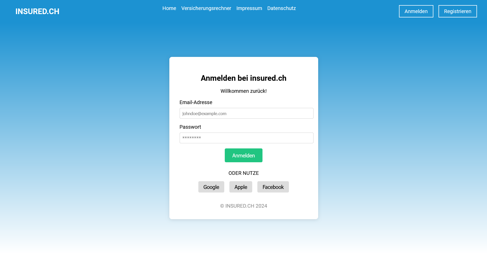
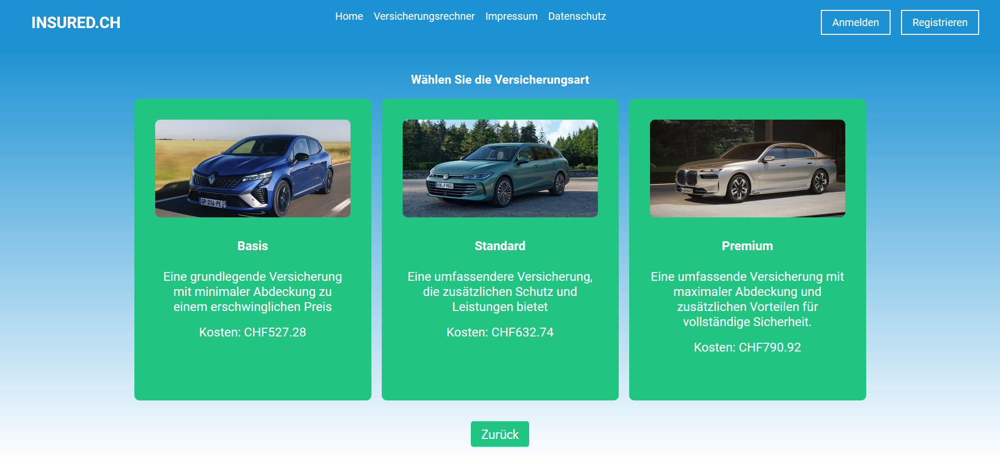

## Inhaltsverzeichnis
- [Inhaltsverzeichnis](#inhaltsverzeichnis)
- [Recherche](#recherche)
  - [Versicherungsrechner Kennenlernen](#versicherungsrechner-kennenlernen)
    - [Beispiele von UI](#beispiele-von-ui)
  - [Problem Statement Map](#problem-statement-map)
  - [Proto Personas](#proto-personas)
    - [Laura Schülerin](#laura-schülerin)
    - [Moritz Geschäftsleiter](#moritz-geschäftsleiter)
    - [Maria Mutter](#maria-mutter)
  - [Journey Map](#journey-map)
    - [Laura Fahrschülerin](#laura-fahrschülerin)
    - [Max Geschäftsleiter](#max-geschäftsleiter)
    - [Maria Mutter](#maria-mutter-1)
  - [Opportunity Areas](#opportunity-areas)
    - [Für Laura Schülerin:](#für-laura-schülerin)
    - [Für Max Geschäftsreisender:](#für-max-geschäftsreisender)
    - [Für Maria Familienmutter:](#für-maria-familienmutter)
  - [Key Screens](#key-screens)
  - [User Stories](#user-stories)
    - [Versicherung berechnen](#versicherung-berechnen)
  - [Wireframe](#wireframe)
    - [Landing Page / Home Page](#landing-page--home-page)
    - [Login Page](#login-page)
    - [Sign Up Page](#sign-up-page)
    - [Versicherungsrechner](#versicherungsrechner)
    - [Versicherungsplan](#versicherungsplan)
- [Programmieren](#programmieren)
  - [Tech Stack Auswahl](#tech-stack-auswahl)
    - [Frontend:](#frontend)
    - [Entwicklungs-Tools](#entwicklungs-tools)
    - [Versionskontrolle](#versionskontrolle)
    - [Warum dieses Stack?](#warum-dieses-stack)
  - [Systemdiagramm](#systemdiagramm)
  - [Angular Commands](#angular-commands)
  - [Bilder der Implementierung](#bilder-der-implementierung)
    - [Landing Page / Home Page](#landing-page--home-page-1)
    - [Login Page](#login-page-1)
    - [Sign Up Page](#sign-up-page-1)
    - [Versicherungsrechner](#versicherungsrechner-1)
    - [Versicherungsplan](#versicherungsplan-1)
- [Reflexion](#reflexion)
- [Quellen / Referenzen](#quellen--referenzen)


## Recherche

Der UI-Prozess ist auch auf diesem Miro Board zu finden: [Miro Board](https://miro.com/app/board/uXjVNgK5FHI=/?share_link_id=352239534071)

### Versicherungsrechner Kennenlernen

- Die meisten Versicherungs- / Prämienrechner haben eine Schritt für Schritt Architektur.
- Der Markt ist sehr gesättigt
- Bisherige Lösungen streben an ihr eigenes Produkt zu verkaufen
- Es fehlen neutrale Lösungen

| Beobachtung                   | Herausforderung/Problem         | Idee/Lösung                        |
| ----------------------------- | ------------------------------- | ---------------------------------- |
| Autopolice berechnen          | Woher Daten?                    | Öffentliche Daten benutzen         |
| Autoversicherung wechseln     | Woher Zahlen von anderen?       | Werbevertrag                       |
| Autoversicherungen vergleichen | Wie stellt man vergleiche dar?   | Direktvergleich zwischen Anbietern |
| Hausrat berechnen             | Welche Rechenmethode nutzt man? | Quadratmetermodell                 |

#### Beispiele von UI
<div style="text-align: center;">
  
  
  
  
  
</div>

### Problem Statement Map

| Nutzergruppe / Zielgruppe | Problem                                                       | Lösungsidee                                                                   | Zielsetzung                            | Randbedingungen           | Stakeholder                               | Risiken                                           |
| ------------------------- | ------------------------------------------------------------- | ----------------------------------------------------------------------------- | -------------------------------------- | ------------------------- | ----------------------------------------- | ------------------------------------------------- |
| Versicherungsnehmer       | Ineffizienter Versicherungsberechnungsprozess                 | Verbesserte Benutzeroberfläche, präziser Algorithmus                          | Benutzerfreundlichkeit, Genauigkeit    | Zeit, Budget, Datenschutz | Versicherungsunternehmen, Entwicklerteam  | Fehlende Akzeptanz, Datenverlust                  |
| Junge Fahrerin            | Komplexe Tarifierung für junge Fahrer                         | Vereinfachte Tarifstruktur, Fahrertraining                                    | Transparente Kostenstrukturen          | Zeit, Budget, Datenschutz | Versicherungsunternehmen, Fahrlehrer      | Hohe Prämien, unzureichende Schulung              |
| Rennfahrer                | Hohe Prämien aufgrund Risikoprofil                            | Individuelle Risikobewertung, Telematiksystem                                 | Reduzierte Versicherungskosten         | Zeit, Budget, Datenschutz | Versicherungsunternehmen, Rennsportteams  | Datenmissbrauch, Einschränkung der Fahrweise      |
| Fahrschüler               | Mangelnde Erfahrung bei Versicherungsabschluss                | Lehrmaterialien für Versicherungsverständnis                                  | Sicherheitsbewusstsein fördern         | Zeit, Budget, Datenschutz | Fahrschulen, Versicherungsunternehmen     | Überforderung, Fehlende finanzielle Mittel        |
| Familien                  | Versicherungsprodukte passen nicht zu Familienbedürfnissen    | Angebote für Familienpakete mit spezifischen Deckungen                        | Abdeckung der Familienrisiken          | Zeit, Budget, Datenschutz | Versicherungsunternehmen, Familienberater | Unzureichende Deckung, hohe Prämien               |
| Freiberufler              | Schwierigkeiten bei der Absicherung von Einkommen und Betrieb | Maßgeschneiderte Policen für Selbstständige mit flexiblen Zahlungsbedingungen | Sicherstellung der Betriebskontinuität | Zeit, Budget, Datenschutz | Versicherungsunternehmen, Berufsverbände  | Unvorhergesehene Risiken, unzureichende Abdeckung |

### Proto Personas

#### Laura Schülerin
- besucht Fahrstunden
- möchte ein Auto kaufen
- muss wissen wieviel es kostet
- informiert sich über den Versicherungsrechner
- braucht noch Begleitperson für Fahrstunden
- findet es schwierig, vertrauenswürdige Informationen zu erhalten

#### Moritz Geschäftsleiter
- ist Betriebsleiter eines Internationalen Unternehmens
- benötigt eine Versicherung, die seine Reisen abdeckt und flexibel ist
- möchte eine schnelle und einfache Möglichkeit, um Versicherungsoptionen zu vergleichen
- sucht online nach Versicherungsoptionen
- mag benutzerfreundliche UI und schnelle Abwicklung
- findet es ärgerlich das andere Plattformen nicht mobilfreundlich sind

#### Maria Mutter
- Mutter von 2 Kindern
- sucht nach Versicherungspaketen, die die Bedürfnisse ihrer Familie abdecken
- braucht finanzielle Sicherheit
- ist Gesundheit besonders wichtig
- bevorzugt es persönlich mit einem Berater zu sprechen
- ist überfordert bei der grossen Anzahl an Optionen

### Journey Map
#### Laura Fahrschülerin

1. **Phase: Vorbereitung auf den Autokauf**
   - **Berührungspunkte:**
     - Laura spricht mit Freunden und Familie über ihre Absicht, ein Auto zu kaufen.
     - Sie beginnt, online nach verfügbaren Fahrzeugmodellen und Preisen zu suchen.
   - **Emotionen und Gedanken:**
     - Aufgeregt, ein eigenes Auto zu besitzen.
     - Besorgt über die Kosten für den Autokauf und die dazugehörige Versicherung.
   - **Handlungen:**
     - Laura recherchiert verschiedene Autotypen und vergleicht Preise.
     - Sie überlegt, welche Versicherungsabdeckung für ihr erstes Auto am besten geeignet wäre.

2. **Phase: Versicherungsrecherche**
   - **Berührungspunkte:**
     - Laura sucht online nach Versicherungsrechnern, um die voraussichtlichen Kosten für die Versicherung ihres Autos zu ermitteln.
     - Sie liest Kundenbewertungen und Feedback zu verschiedenen Versicherungsunternehmen.
   - **Emotionen und Gedanken:**
     - Verwirrung über die Vielzahl von Versicherungsoptionen und -deckungen.
     - Frustration über komplizierte und schwer verständliche Versicherungsrechner.
   - **Handlungen:**
     - Laura gibt ihre Fahrerinformationen und Fahrzeuginformationen in verschiedene Versicherungsrechner ein.
     - Sie sucht nach Möglichkeiten, eine Begleitperson für ihre Fahrstunden zu finden, um die Kosten zu senken.

3. **Phase: Auswahl und Abschluss der Versicherung**
   - **Berührungspunkte:**
     - Laura erhält Angebote von verschiedenen Versicherungsunternehmen über ihre Versicherungsrechner.
     - Sie spricht mit einem Versicherungsberater, um zusätzliche Informationen zu den Angeboten zu erhalten.
   - **Emotionen und Gedanken:**
     - Erleichterung, als sie eine Versicherung findet, die ihrem Budget und ihren Bedürfnissen entspricht.
     - Unsicherheit darüber, ob sie die richtige Wahl getroffen hat.
   - **Handlungen:**
     - Laura vergleicht die erhaltenen Angebote hinsichtlich Preisen, Deckungen und Kundenbewertungen.
     - Sie schließt online die Versicherung ab und plant, ihre Begleitperson für die Fahrstunden zu kontaktieren.

4. **Phase: Nach dem Abschluss**
   - **Berührungspunkte:**
     - Laura erhält ihre Versicherungspolice per E-Mail.
     - Sie organisiert die nächsten Fahrstunden mit ihrer Begleitperson.
   - **Emotionen und Gedanken:**
     - Zufriedenheit darüber, dass sie den Autokauf und die Versicherung erfolgreich abgeschlossen hat.
     - Aufregung, das Auto endlich fahren zu können.
   - **Handlungen:**
     - Laura speichert die Versicherungsdokumente sicher und plant ihre ersten Fahrstunden mit ihrer Begleitperson.

#### Max Geschäftsleiter
1. **Phase: Identifizierung des Versicherungsbedarfs**
    
    - **Berührungspunkte:**
        - Max reflektiert über die Art seiner geschäftlichen Reisen und die potenziellen Risiken.
        - Er recherchiert online nach Versicherungsanbietern, die auf Geschäftsreisende spezialisiert sind.
    - **Emotionen und Gedanken:**
        - Besorgt über die Sicherheit während seiner häufigen Geschäftsreisen.
        - Interesse an flexiblen Versicherungsoptionen, die seine spezifischen Bedürfnisse als Geschäftsreisender berücksichtigen.
    - **Handlungen:**
        - Max überprüft seine aktuellen Versicherungsdeckungen und identifiziert mögliche Lücken oder unzureichende Abdeckungen.
        - Er sucht aktiv nach Versicherungsanbietern, die spezielle Versicherungspakete für Geschäftsreisende anbieten.
2. **Phase: Recherche und Angebotsvergleich**
    
    - **Berührungspunkte:**
        - Max verwendet Online-Versicherungsrechner, um verschiedene Versicherungsoptionen zu vergleichen.
        - Er liest Bewertungen und Erfahrungen anderer Geschäftsreisender mit verschiedenen Versicherungsanbietern.
    - **Emotionen und Gedanken:**
        - Verwirrung über die Vielzahl von Versicherungsangeboten und -bedingungen.
        - Frustration über komplizierte Online-Versicherungsrechner und undurchsichtige Preisstrukturen.
    - **Handlungen:**
        - Max gibt seine Reisedaten und spezifischen Anforderungen in verschiedene Versicherungsrechner ein, um präzise Angebote zu erhalten.
        - Er vergleicht die erhaltenen Angebote hinsichtlich Preisen, Deckungen und Flexibilität.
3. **Phase: Auswahl und Abschluss der Versicherung**
    
    - **Berührungspunkte:**
        - Max spricht mit einem Versicherungsberater, um zusätzliche Informationen zu den Versicherungsoptionen zu erhalten.
        - Er trifft eine fundierte Entscheidung und schließt online die Versicherung ab.
    - **Emotionen und Gedanken:**
        - Erleichterung darüber, eine Versicherung gefunden zu haben, die seine Bedürfnisse erfüllt.
        - Skepsis darüber, ob die gewählte Versicherung im Ernstfall ausreichend sein wird.
    - **Handlungen:**
        - Max überprüft die Versicherungsdokumente sorgfältig und sichert sie an einem zugänglichen Ort.
        - Er plant, die Versicherungsdetails in seine Reisevorbereitungen einzubeziehen und notwendige Kontaktdaten griffbereit zu halten.

#### Maria Mutter
1. **Phase: Identifizierung des Versicherungsbedarfs für die Familie**
    
    - **Berührungspunkte:**
        - Maria denkt über die finanzielle Sicherheit ihrer Familie nach und identifiziert potenzielle Versicherungsbedürfnisse.
        - Sie recherchiert online nach Versicherungsanbietern, die Familienversicherungen anbieten.
    - **Emotionen und Gedanken:**
        - Besorgt über den Schutz ihrer Familie vor unvorhergesehenen Ereignissen wie Krankheiten, Unfällen oder Naturkatastrophen.
        - Interesse an umfassenden Versicherungspaketen, die verschiedene Lebensbereiche abdecken.
    - **Handlungen:**
        - Maria überprüft ihre aktuellen Versicherungsdeckungen und identifiziert mögliche Lücken oder unzureichende Abdeckungen für ihre Familie.
        - Sie sucht aktiv nach Versicherungsanbietern, die Pakete für Familien mit Kindern anbieten.
2. **Phase: Recherche und Angebotsvergleich**
    
    - **Berührungspunkte:**
        - Maria verwendet Online-Versicherungsrechner, um verschiedene Versicherungsoptionen zu vergleichen.
        - Sie liest Bewertungen und Erfahrungen anderer Eltern mit verschiedenen Versicherungsanbietern.
    - **Emotionen und Gedanken:**
        - Verwirrung über die Vielzahl von Versicherungsangeboten und -bedingungen.
        - Frustration über komplizierte Online-Versicherungsrechner und undurchsichtige Preisstrukturen.
    - **Handlungen:**
        - Maria gibt die spezifischen Anforderungen ihrer Familie in verschiedene Versicherungsrechner ein, um maßgeschneiderte Angebote zu erhalten.
        - Sie vergleicht die erhaltenen Angebote hinsichtlich Preisen, Deckungen und Flexibilität.
3. **Phase: Auswahl und Abschluss der Versicherungen**
    
    - **Berührungspunkte:**
        - Maria spricht mit einem Versicherungsberater, um zusätzliche Informationen zu den Versicherungsoptionen zu erhalten.
        - Sie trifft fundierte Entscheidungen und schließt online die Versicherungen ab.
    - **Emotionen und Gedanken:**
        - Erleichterung darüber, Versicherungen gefunden zu haben, die die Bedürfnisse ihrer Familie erfüllen.
        - Unsicherheit darüber, ob die gewählten Versicherungen im Ernstfall ausreichend sein werden.
    - **Handlungen:**
        - Maria überprüft die Versicherungsdokumente sorgfältig und sichert sie an einem zugänglichen Ort.
        - Sie plant, die Versicherungsdetails in ihre Familienfinanzen einzubeziehen und ihre Kinder und Partner über die wichtigsten Aspekte zu informieren.

### Opportunity Areas

#### Für Laura Schülerin:

1. **Benutzerfreundlichere Versicherungsrechner:** Entwicklung von Versicherungsrechnern mit intuitiver Benutzeroberfläche und einfacherer Navigation, um Lauras Frustration über die Komplexität und Unübersichtlichkeit zu reduzieren.
    
2. **Integration von Begleitperson-Suche:** Einbindung von Funktionen zur Begleitperson-Suche in Versicherungsplattformen, um Lauras Anforderungen an eine Begleitperson für ihre Fahrstunden zu erfüllen und den gesamten Prozess für sie zu erleichtern.
    

#### Für Max Geschäftsreisender:

1. **Mobile-freundliche Plattformen:** Bereitstellung von mobilen Anwendungen oder responsiven Websites, um Max' Frustration über die Schwierigkeiten beim Abschluss von Versicherungen unterwegs zu reduzieren und ihm einen bequemen Zugang zu Versicherungsdienstleistungen zu ermöglichen.
    
2. **Transparente Preisgestaltung:** Klare Darstellung der Preise und Bedingungen für Versicherungspakete, um Max' Verwirrung und Frustration über undurchsichtige Preisstrukturen zu mindern und ihm eine fundierte Entscheidung zu erleichtern.
    

#### Für Maria Familienmutter:

1. **Personalisierte Beratung:** Einrichtung von Beratungsdiensten für Familien, um Maria dabei zu unterstützen, maßgeschneiderte Versicherungspakete auszuwählen, die ihre spezifischen Bedürfnisse und Anforderungen erfüllen.
    
2. **Einfachere Online-Recherche:** Verbesserung der Online-Versicherungsrechner und -Plattformen, um Marias Suche nach Versicherungen zu vereinfachen und ihre Frustration über komplexe Recherche- und Vergleichsprozesse zu reduzieren.

### Key Screens


### User Stories
#### Versicherung berechnen
- Anmelden
	- E-Mail eingeben
	- Link zum Zurücksetzen erhalten
	- Neues Passwort eingeben
	- Passwort bestätigen
	- Änderungen speichern
- Versicherung suchen
	- Optionen anzeigen
	- Fahrzeugdetails eingeben
	- Fahrerinformationen eingeben
	- Kosten anzeigen
- Versicherung auswählen
	- Planoptionen aufzeigen
	- Passenden Plan auswählen
	- Deckungen vergleichen
	- Optionen bewerten
- Versicherung abschliessen
	- Zahlungsinfo eingeben
	- Zahlungsmethode wählen
	- Zahlung versenden
	- Bestätigung erhalten

### Wireframe

Figma link:
[Versicherungsrechner Figma](https://www.figma.com/file/yvczcEs5roF7GnffkcIDtm/Versicherungsrechner-2?type=design&node-id=0%3A1&mode=design&t=LADFwJdGiodN6JSW-1)

#### Landing Page / Home Page

#### Login Page

#### Sign Up Page

#### Versicherungsrechner

#### Versicherungsplan


## Programmieren

### Tech Stack Auswahl

#### Frontend:
-  Angular
-  TypeScript
-  HTML
-  CSS
-  Angular CLI

#### Entwicklungs-Tools
-  Node.js
-  npm
-  Visual Studio Code
-  Vercel

#### Versionskontrolle
-  Git
-  GitHub

#### Warum dieses Stack?
Angular gibt es schon lange in der Welt der Frontend JavaScript Frameworks, aber es ist nicht zu unterschätzen. React hat Angular in der popularität überholt, doch Angular erlebt zur Zeit eine "Renaissance" und da ich schon öfters React benutzt habe, wollte ich es wagen ein für mich neues JS Framework zu lernen, zusammen mit TypeScript.  
Die restlichen Tools habe ich schon öfters verwendet und ich bin vertraut mit denen. Ich habe diese gewählt damit es nicht zu komplex wird und ich mich aufs lernen von Angular fokusieren kann.

### Systemdiagramm


### Angular Commands

 ```sh
 npm install -g @angular/cli
 ```
 ```sh
 ng new my-app
 ```
 ```sh
 ng serve --open
 ```
 ```sh
 ng generate component home --inline-template --skip-tests
 ```
 ```sh
 ng generate class my-class
 ```
  ```sh
  ng generate interface my-interface
  ```
  ```sh
  ng build --prod
  ```
  ```sh
  ng lint
  ```
  ```sh
  ng update @angular/cli @angular/core
  ```

### Bilder der Implementierung

#### Landing Page / Home Page

#### Login Page

#### Sign Up Page

#### Versicherungsrechner

#### Versicherungsplan


## Reflexion

Während dieses Projekts habe ich eine umfassende Anwendung für einen Versicherungsrechner entwickelt, die es den Nutzern ermöglicht, Versicherungen für ihre Fahrzeuge zu berechnen und Angebote zu vergleichen. Ausgangspunkt war die Erkenntnis, dass der Markt für Versicherungsrechner gesättigt ist, jedoch neutrale Lösungen fehlen. Ich habe daher eine Anwendung erstellt, die öffentlich zugängliche Daten nutzt und einen benutzerfreundlichen Prozess für den Versicherungswechsel bietet. Durch die Nutzung von Angular und TypeScript konnte ich eine robuste und skalierbare Anwendung entwickeln, die den Anforderungen moderner Webentwicklung entspricht. Der Einsatz bekannter Entwicklungs-Tools wie Node.js und Visual Studio Code half mir, effizient zu arbeiten und die Projektziele zu erreichen.  

Die Entwicklung dieser Anwendung war eine wertvolle Lernerfahrung. Ich konnte mein Wissen in Angular und TypeScript vertiefen und neue Fähigkeiten im Bereich der Webentwicklung erlangen. Besonders hilfreich war die theoretische Auseinandersetzung mit den Prinzipien der Softwarearchitektur und des UX Designs, die mir halfen, fundierte Entscheidungen zu treffen. Die größte Herausforderung war die Balance zwischen einer umfassenden Funktionalität und einer benutzerfreundlichen Oberfläche. Rückblickend würde ich das Projekt als Erfolg bewerten, da es mir gelang, eine funktionale und intuitive Anwendung zu erstellen, die den Nutzern einen echten Mehrwert bietet. In zukünftigen Projekten möchte ich öfters Angular benutzen, da mir die Art und Weise der Entwichlung sehr gefallen hat.

## Quellen / Referenzen

**Vergleiche von anderen Websiten:**
- [comparis.ch](https://www.comparis.ch/)
- [AXA](https://www.axa.ch/de/privatkunden.html)
- [Mobiliar Prämienrechner](https://secure.mobiliar.ch/praemienrechner/casa-grundlagen)
- [Generali Autoversicherung](https://www.gch.generali.ch/privatkunden/fahrzeuge-reisen/autoversicherung/offerte-autoversicherung)

**Ideen/Inspiration:**
- [OpenAI Chat](https://chat.openai.com/)
- [Figma Templates](https://www.figma.com/community/file/1232528346774034120/login-sign-up-templates-desktop?searchSessionId=lu5zlapk-1t34em9w9fc)


**Bilder:**
- [Landing Page Car: Jaguar XF](https://media.jaguar.com)
- [Basic Car: Renault Clio](https://de.renault.ch/)
- [Standard Car: VW Passat](https://www.volkswagen.ch)
- [Premium Car: BMW I7](https://www.bmw.de)